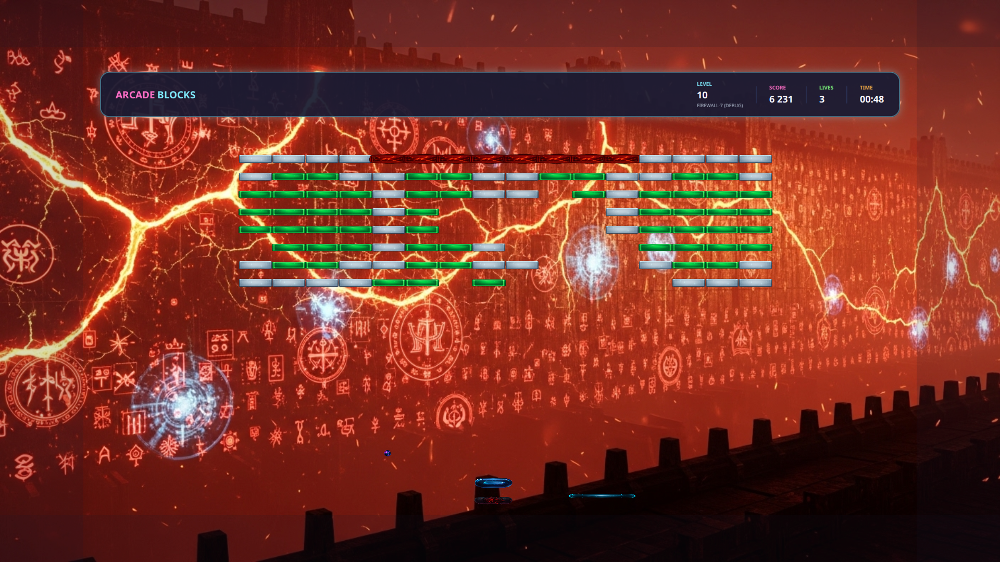

# 🎮 Arcade Blocks

<div align="center">
  
</div>

> A modern, neon-styled arcade block breaking game inspired by classic Arkanoid and LBreakoutHD built with JavaFX and FXGL.

[](https://www.oracle.com/java/)
[](https://github.com/AlmasB/FXGL)
[](LICENSE)

**English** | **[Русский](README_ru.md)**

---

## 🌟 Features

### Core Gameplay
- **116 Unique Levels** - Handcrafted level designs with increasing difficulty
- **Epic Boss Battles** - Face challenging bosses at levels 50, 100, and 116 with cinematic cutscenes
- **Story Mode** - Immersive narrative with chapter-based storytelling
- **Power-Up System** - 20+ different power-ups including shields, plasma cannons, extra lives, and more
- **Progressive Difficulty** - Dynamic difficulty scaling across multiple chapters

### Technical Highlights
- **Cross-Platform** - Native support for Linux, Windows, and macOS
- **SDL2 Audio Engine** - High-quality audio with separate music/SFX controls via SDL2_mixer
- **VLC Video Integration** - Cinematic boss battle cutscenes using VLCJ
- **Smooth Physics** - FXGL-powered Box2D physics with continuous collision detection
- **Bilingual Support** - Full English and Russian localization

### Visual & Audio
- **Neon Aesthetic** - Vibrant pastel-neon color palette
- **Dynamic Effects** - Particle systems, screen shake, and smooth animations
- **Original Soundtrack** - Atmospheric music and sound effects
- **1920x1080 Support** - Multiple resolution options with scaling

---

## 📖 Documentation

For detailed technical documentation, architecture overview, and development guides, see **[DOCUMENTATION.md](DOCUMENTATION.md)**.

---

## 📸 Screenshots

<div align="center">

| Main Menu | Gameplay | Boss Battle |
|:---------:|:--------:|:-----------:|
|  |  |  |

</div>

---

## 🚀 Quick Start

### Prerequisites
- **Java 21** or higher ([Download JDK](https://www.azul.com/downloads/?package=jdk-fx#zulu))
- **Gradle** (included via wrapper)
- **Git LFS** (for video files) - [Install Git LFS](https://git-lfs.github.com/)
- **VLC Media Player** (optional, for boss videos)

### Running from Source

```bash
# Clone the repository
git clone https://github.com/leocallidus/arcadeblocks.git
cd arcadeblocks

# Pull video files from Git LFS
git lfs pull

# Run the game
./gradlew run
```

**Note**: This project uses Git LFS to store large video files (boss cutscenes). Make sure Git LFS is installed before cloning. If videos don't play, run `git lfs pull` to download them.

---

## 🎯 How to Play

### Controls (Default)
- **Arrow Keys** (← →) - Move paddle
- **Space** - Launch ball
- **V** - Call ball back (special ability)
- **X** - Turbo paddle boost
- **Z** - Fire plasma weapon (when unlocked)
- **Esc** - Pause menu

### Objective
Break all the bricks to complete each level. Collect falling power-ups to gain advantages, but watch out for negative effects! Defeat bosses to progress through chapters.

### Power-Ups
- 🛡️ **Shield** - Protective barrier below paddle
- ⚡ **Turbo Ball** - Faster ball speed
- 🔫 **Plasma Cannon** - Shoot bricks directly
- ➕ **Extra Life** - Gain an additional life
- 📏 **Expand Paddle** - Increase paddle size
- 🎯 **Multi-Ball** - Multiple balls in play
- ⚠️ **Chaos Balls** - Random ball directions (negative)
- 👻 **Ghost Paddle** - Paddle becomes semi-transparent (negative)

---

## 🔧 Building & Distribution

### Development Build

```bash
# Clean build
./gradlew clean build

# Run tests
./gradlew test

# Create executable JAR with dependencies
./gradlew jar
```

The JAR will be created in `build/libs/`.

### Distribution Packages

#### Linux AppImage
```bash
./gradlew createLinuxAppImage
```
Creates a portable AppImage with embedded JRE in `build/jpackage-linux/`.

#### Windows Portable
```bash
./gradlew createWindowsPortable
```
Creates a portable Windows application in `build/jpackage-portable/`.

#### Windows Installer
```bash
./gradlew createWindowsExe
```
Requires WiX Toolset 3.x. Creates installer in `build/jpackage/`.

---

## 🛠️ Technology Stack

### Core Framework
- **[FXGL 21.1](https://github.com/AlmasB/FXGL)** - Game engine built on JavaFX
- **[JavaFX 21](https://openjfx.io/)** - UI framework
- **Java 21** - Programming language

### Audio & Video
- **[SDL2](https://www.libsdl.org/) + SDL2_mixer** - Cross-platform audio via JNA
- **[VLCJ 4.8.2](https://github.com/caprica/vlcj)** - Video playback for cutscenes
- **[JNA 5.14.0](https://github.com/java-native-access/jna)** - Native library bindings

### Data & Persistence
- **[SQLite](https://www.sqlite.org/)** - Save game data and progress tracking
- **[Jackson 2.15.2](https://github.com/FasterXML/jackson)** - JSON parsing for level files

### Testing
- **JUnit 5** - Unit testing framework
- **Mockito 5** - Mocking framework
- **TestFX 4** - JavaFX UI testing

---

## 📁 Project Structure

```
arcade_blocks_game/
├── src/main/java/com/arcadeblocks/
│   ├── ArcadeBlocksApp.java          # Main application (7700+ lines)
│   ├── ArcadeBlocksFactory.java      # Entity factory
│   ├── audio/                        # SDL2 audio system
│   ├── bosses/                       # Boss AI implementations
│   ├── config/                       # Game configuration
│   ├── gameplay/                     # Core gameplay components
│   ├── levels/                       # Level loading & generation
│   ├── localization/                 # i18n support
│   ├── nativelib/                    # Native library loader
│   ├── persistence/                  # Save/load system
│   ├── ui/                           # All UI views
│   ├── utils/                        # Utility classes
│   └── video/                        # Video backend abstraction
├── src/main/resources/
│   ├── assets/
│   │   ├── levels/                   # 116 JSON level files
│   │   ├── textures/                 # Sprites & images
│   │   ├── sounds/                   # Sound effects
│   │   ├── music/                    # Background music
│   │   └── videos/                   # Boss cutscenes
│   ├── i18n/                         # Localization files
│   └── natives/                      # Platform-specific libraries
├── src/test/java/                    # Unit & integration tests
├── build.gradle                      # Build configuration
├── DOCUMENTATION.md                  # Development guide
└── README.md                         # This file
```

---

## 🧪 Testing

Run all tests:
```bash
./gradlew test
```

Run specific test class:
```bash
./gradlew test --tests com.arcadeblocks.utils.DatabaseIntegrityTest
```

Run tests in headless mode (for CI):
```bash
./gradlew test -Dtestfx.robot=glass -Dtestfx.headless=true
```

---

## 🎨 Development Guide

### Adding a New Level

1. Create `levelXXX.json` in `src/main/resources/assets/levels/`:
```json
{
  "name": "Level Name",
  "description": "Level description",
  "layout": {
    "brickColumns": 16,
    "brickRows": 8,
    "brickWidth": 60,
    "brickHeight": 30
  },
  "bricks": [
    {"row": 0, "col": 0, "color": "blue", "health": 1, "points": 100}
  ]
}
```

2. Level will be automatically loaded by `LevelLoader`

### Adding a New Power-Up

1. Add enum constant to `BonusType.java`
2. Define texture name and behavior
3. Implement activation logic in `ArcadeBlocksApp.activateBonus()`
4. Add deactivation in `deactivateBonus()`
5. Update localization files in `src/main/resources/i18n/`

### Memory Management

All UI views must implement cleanup to prevent memory leaks:
```java
public class MyView implements SupportsCleanup {
    @Override
    public void cleanup() {
        UINodeCleanup.cleanup(rootNode);
        // Stop timers, clear references
    }
}
```

See `DOCUMENTATION.md` for detailed architecture documentation.

---

## 🌍 Localization

The game supports multiple languages via property files:
- `src/main/resources/i18n/messages_en.properties` - English
- `src/main/resources/i18n/messages_ru.properties` - Russian

To add a new language:
1. Create `messages_{code}.properties`
2. Translate all keys from English version
3. Add language option in `LanguageView.java`

---

## 🐛 Known Issues & Limitations

### Linux
- VLC must be installed system-wide for boss videos
- Some window managers may have scaling issues with 1920x1080

### Windows
- First launch may be slow while extracting native libraries
- Antivirus software may flag the executable (false positive)

### macOS
- Video playback requires VLC 3.x installation
- ARM64 (Apple Silicon) support requires Rosetta 2 for VLC

---

## 🤝 Contributing

Contributions are welcome! Please follow these guidelines:

1. **Fork** the repository
2. **Create** a feature branch (`git checkout -b feature/amazing-feature`)
3. **Commit** your changes (`git commit -m 'Add amazing feature'`)
4. **Push** to the branch (`git push origin feature/amazing-feature`)
5. **Open** a Pull Request

### Code Style
- Follow existing Java conventions
- Add JavaDoc comments for public methods
- Write tests for new features
- Ensure `./gradlew build` passes

---

## 📜 License

This project is licensed under the MIT License - see the [LICENSE](LICENSE) file for details.

---

## 👏 Credits

### Development
- **LC Games** - Original concept and development

### Technologies
- **[FXGL](https://github.com/AlmasB/FXGL)** by Almas Baimagambetov
- **[VLCJ](https://github.com/caprica/vlcj)** by Caprica Software
- **[SDL2](https://www.libsdl.org/)** by Sam Lantinga and contributors

### Inspiration
- Classic **Arkanoid** arcade game
- Modern indie block breakers

---

## 📞 Support

- **Issues**: [GitHub Issues](https://github.com/leocallidus/arcadeblocks/issues)
- **Discussions**: [GitHub Discussions](https://github.com/leocallidus/arcadeblocks/discussions)

---

<div align="center">

**[⬆ Back to Top](#-arcade-blocks)**

Made with ❤️ by LC Games

</div>
