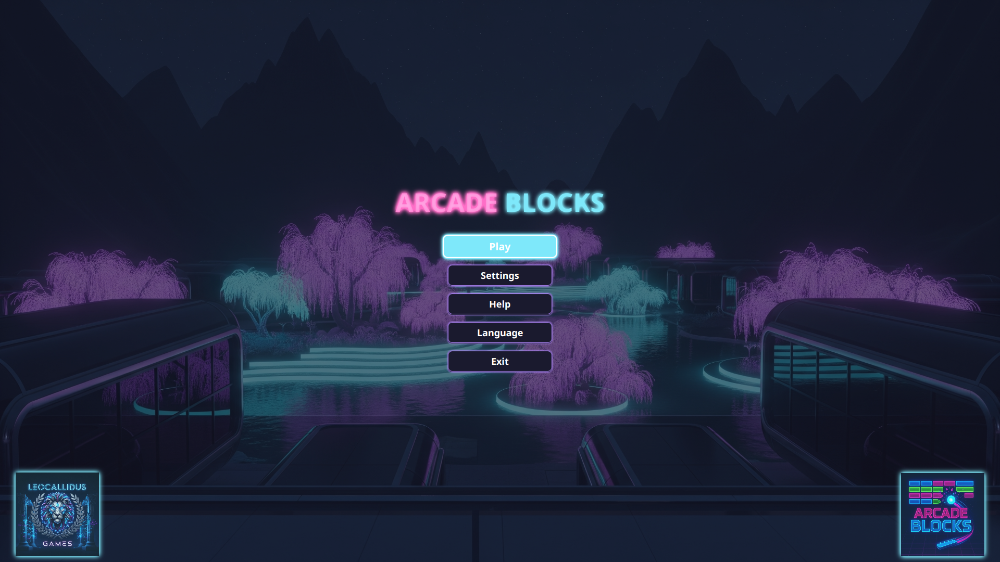
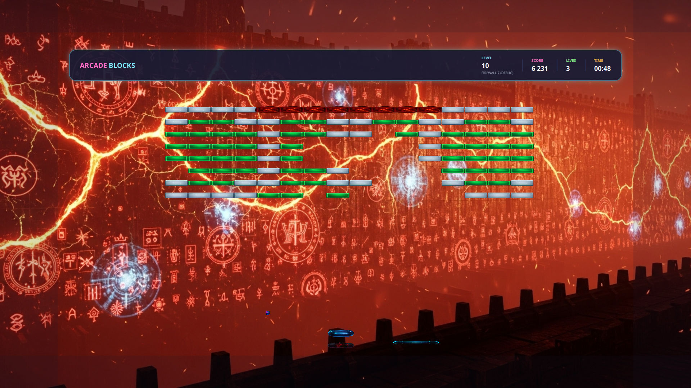

# 🎮 Arcade Blocks

<div align="center">
  
</div>

> Современная аркадная игра в стиле неона, вдохновленная классическими Arkanoid и LBreakoutHD, созданная на JavaFX и FXGL.

[](https://www.oracle.com/java/)
[](https://github.com/AlmasB/FXGL)
[](LICENSE)

**[English](README.md)** | **Русский**

---

# Не клонируйте данный репозиторий, потому-что я испортил его, скачайте исходный код здесь: https://drive.google.com/file/d/1iVfr5K195ifPii4-s_xu7vkTURydLBaM/view?usp=sharing

## 🌟 Возможности

### Основной геймплей
- **116 уникальных уровней** - Тщательно продуманный дизайн уровней с возрастающей сложностью
- **Эпические битвы с боссами** - Сражайтесь с боссами на уровнях 50, 100 и 116 с кинематографическими заставками
- **Сюжетный режим** - Увлекательное повествование с разделением на главы
- **Система бонусов** - Более 20 различных бонусов, включая щиты, плазменные пушки, дополнительные жизни и многое другое
- **Прогрессивная сложность** - Динамическое масштабирование сложности в разных главах

### Технические особенности
- **Кроссплатформенность** - Встроенная поддержка Linux, Windows и macOS
- **Аудио-движок SDL2** - Высококачественное аудио с раздельным управлением музыкой и звуковыми эффектами через SDL2_mixer
- **Интеграция с VLC** - Кинематографические заставки битв с боссами с использованием VLCJ
- **Плавная физика** - Физика Box2D на базе FXGL с непрерывным обнаружением столкновений
- **Двуязычная поддержка** - Полная локализация на английский и русский языки

### Визуальные и аудио эффекты
- **Неоновая эстетика** - Яркая пастельно-неоновая цветовая палитра
- **Динамические эффекты** - Системы частиц, тряска экрана и плавные анимации
- **Оригинальный саундтрек** - Атмосферная музыка и звуковые эффекты
- **Поддержка 1920x1080** - Несколько вариантов разрешения с масштабированием

---

## 📖 Документация

Подробную техническую документацию, обзор архитектуры и руководства по разработке смотрите в **[DOCUMENTATION_ru.md](DOCUMENTATION_ru.md)**.

---

## 📸 Скриншоты

<div align="center">

| Главное меню | Геймплей | Битва с боссом |
|:------------:|:--------:|:--------------:|
|  |  |  |

</div>

---

## 🚀 Быстрый старт

### Требования
- **Java 21 с JavaFX** (например, Azul Zulu FX JDK 21 с уже включенным JavaFX) — установите `JAVA_HOME` на этот JDK
- **Gradle Wrapper** — используйте `./gradlew`/`gradlew.bat` из репозитория (при первом запуске Gradle будет загружен автоматически)
- **Git LFS** (для видеофайлов) - [Установить Git LFS](https://git-lfs.github.com/)
- **VLC Media Player** (опционально, для видео с боссами)

Быстрые команды Git LFS:
```bash
git lfs install          # однократная настройка
git lfs fetch --all      # получить все объекты LFS
git lfs pull             # скачать файлы для текущей ветки
git lfs status           # проверить, что файлы загружены
```

### Запуск из исходного кода

```bash
# Клонировать репозиторий
git clone https://github.com/leocallidus/arcadeblocks.git
cd arcadeblocks

# Загрузить видеофайлы из Git LFS
git lfs pull

# Запустить игру
./gradlew run
```

**Примечание**: Этот проект использует Git LFS для хранения больших видеофайлов (заставки боссов). Убедитесь, что Git LFS установлен перед клонированием. Если видео не воспроизводятся, выполните `git lfs pull` для их загрузки.

---

## 🎯 Как играть

### Управление (по умолчанию)
- **Стрелки** (← →) - Перемещение платформы
- **Пробел** - Запуск мяча
- **V** - Вызвать мяч обратно (специальная способность)
- **X** - Турбо-ускорение платформы
- **Z** - Выстрел из плазменного оружия (когда разблокировано)
- **Esc** - Меню паузы

### Цель
Разбейте все блоки, чтобы завершить каждый уровень. Собирайте падающие бонусы для получения преимуществ, но остерегайтесь негативных эффектов! Побеждайте боссов, чтобы продвигаться по главам.

### Бонусы
- 🛡️ **Щит** - Защитный барьер под платформой
- ⚡ **Турбо-мяч** - Увеличенная скорость мяча
- 🔫 **Плазменная пушка** - Стреляйте по блокам напрямую
- ➕ **Дополнительная жизнь** - Получите дополнительную жизнь
- 📏 **Расширение платформы** - Увеличение размера платформы
- 🎯 **Мульти-мяч** - Несколько мячей в игре
- ⚠️ **Хаос-мячи** - Случайные направления мяча (негативный)
- 👻 **Призрачная платформа** - Платформа становится полупрозрачной (негативный)

---

## 🔧 Сборка и распространение

### Сборка для разработки

```bash
# Чистая сборка
./gradlew clean build

# Запуск тестов
./gradlew test

# Создание исполняемого JAR с зависимостями
./gradlew jar
```

JAR будет создан в `build/libs/`.

### Пакеты для распространения

#### Linux AppImage
```bash
./gradlew createLinuxAppImage
```
Создает портативный AppImage со встроенной JRE в `build/jpackage-linux/`.

#### Windows Portable
```bash
./gradlew createWindowsPortable
```
Создает портативное приложение для Windows в `build/jpackage-portable/`.

#### Windows Installer
```bash
./gradlew createWindowsExe
```
Требует WiX Toolset 3.x. Создает установщик в `build/jpackage/`.

---

## 🛠️ Технологический стек

### Основной фреймворк
- **[FXGL 21.1](https://github.com/AlmasB/FXGL)** - Игровой движок на основе JavaFX
- **[JavaFX 21](https://openjfx.io/)** - UI фреймворк
- **Java 21** - Язык программирования

### Аудио и видео
- **[SDL2](https://www.libsdl.org/) + SDL2_mixer** - Кроссплатформенное аудио через JNA
- **[VLCJ 4.8.2](https://github.com/caprica/vlcj)** - Воспроизведение видео для заставок
- **[JNA 5.14.0](https://github.com/java-native-access/jna)** - Привязки нативных библиотек

### Данные и сохранения
- **[SQLite](https://www.sqlite.org/)** - Сохранение игровых данных и отслеживание прогресса
- **[Jackson 2.15.2](https://github.com/FasterXML/jackson)** - Парсинг JSON для файлов уровней

### Тестирование
- **JUnit 5** - Фреймворк для модульного тестирования
- **Mockito 5** - Фреймворк для создания моков
- **TestFX 4** - Тестирование UI JavaFX

---

## 📁 Структура проекта

```
arcade_blocks_game/
├── src/main/java/com/arcadeblocks/
│   ├── ArcadeBlocksApp.java          # Основное приложение (7700+ строк)
│   ├── ArcadeBlocksFactory.java      # Фабрика сущностей
│   ├── audio/                        # Аудио система SDL2
│   ├── bosses/                       # Реализации ИИ боссов
│   ├── config/                       # Конфигурация игры
│   ├── gameplay/                     # Основные компоненты геймплея
│   ├── levels/                       # Загрузка и генерация уровней
│   ├── localization/                 # Поддержка i18n
│   ├── nativelib/                    # Загрузчик нативных библиотек
│   ├── persistence/                  # Система сохранения/загрузки
│   ├── ui/                           # Все UI представления
│   ├── utils/                        # Утилитные классы
│   └── video/                        # Абстракция видео-бэкенда
├── src/main/resources/
│   ├── assets/
│   │   ├── levels/                   # 116 JSON файлов уровней
│   │   ├── textures/                 # Спрайты и изображения
│   │   ├── sounds/                   # Звуковые эффекты
│   │   ├── music/                    # Фоновая музыка
│   │   └── videos/                   # Заставки боссов
│   ├── i18n/                         # Файлы локализации
│   └── natives/                      # Библиотеки для конкретных платформ
├── src/test/java/                    # Модульные и интеграционные тесты
├── build.gradle                      # Конфигурация сборки
├── DOCUMENTATION.md                  # Руководство по разработке
└── README.md                         # Этот файл
```

---

## 🧪 Тестирование

Запуск всех тестов:
```bash
./gradlew test
```

Запуск конкретного тестового класса:
```bash
./gradlew test --tests com.arcadeblocks.utils.DatabaseIntegrityTest
```

Запуск тестов в headless режиме (для CI):
```bash
./gradlew test -Dtestfx.robot=glass -Dtestfx.headless=true
```

---

## 🎨 Руководство по разработке

### Добавление нового уровня

1. Создайте `levelXXX.json` в `src/main/resources/assets/levels/`:
```json
{
  "name": "Название уровня",
  "description": "Описание уровня",
  "layout": {
    "brickColumns": 16,
    "brickRows": 8,
    "brickWidth": 60,
    "brickHeight": 30
  },
  "bricks": [
    {"row": 0, "col": 0, "color": "blue", "health": 1, "points": 100}
  ]
}
```

2. Уровень будет автоматически загружен с помощью `LevelLoader`

### Добавление нового бонуса

1. Добавьте константу enum в `BonusType.java`
2. Определите название текстуры и поведение
3. Реализуйте логику активации в `ArcadeBlocksApp.activateBonus()`
4. Добавьте деактивацию в `deactivateBonus()`
5. Обновите файлы локализации в `src/main/resources/i18n/`

### Управление памятью

Все UI представления должны реализовывать очистку для предотвращения утечек памяти:
```java
public class MyView implements SupportsCleanup {
    @Override
    public void cleanup() {
        UINodeCleanup.cleanup(rootNode);
        // Остановите таймеры, очистите ссылки
    }
}
```

Смотрите `DOCUMENTATION.md` для подробной документации по архитектуре.

---

## 🌍 Локализация

Игра поддерживает несколько языков через property-файлы:
- `src/main/resources/i18n/messages_en.properties` - Английский
- `src/main/resources/i18n/messages_ru.properties` - Русский

Чтобы добавить новый язык:
1. Создайте `messages_{код}.properties`
2. Переведите все ключи из английской версии
3. Добавьте опцию языка в `LanguageView.java`

---

## 🐛 Известные проблемы и ограничения

### Linux
- VLC должен быть установлен системно для видео с боссами
- Некоторые оконные менеджеры могут иметь проблемы с масштабированием 1920x1080

### Windows
- Первый запуск может быть медленным из-за извлечения нативных библиотек
- Антивирусное ПО может пометить исполняемый файл (ложное срабатывание)

### macOS
- Воспроизведение видео требует установки VLC 3.x
- Поддержка ARM64 (Apple Silicon) требует Rosetta 2 для VLC

---

## 🤝 Вклад в проект

Приветствуются вклады! Пожалуйста, следуйте этим рекомендациям:

1. **Сделайте Fork** репозитория
2. **Создайте** ветку для функции (`git checkout -b feature/amazing-feature`)
3. **Зафиксируйте** ваши изменения (`git commit -m 'Add amazing feature'`)
4. **Отправьте** в ветку (`git push origin feature/amazing-feature`)
5. **Откройте** Pull Request

### Стиль кода
- Следуйте существующим соглашениям Java
- Добавляйте комментарии JavaDoc для публичных методов
- Пишите тесты для новых функций
- Убедитесь, что `./gradlew build` проходит успешно

---

## 📜 Лицензия

Этот проект лицензирован под MIT License - смотрите файл [LICENSE](LICENSE) для подробностей.

---

## 👏 Благодарности

### Разработка
- **LC Games** - Оригинальная концепция и разработка

### Технологии
- **[FXGL](https://github.com/AlmasB/FXGL)** от Almas Baimagambetov
- **[VLCJ](https://github.com/caprica/vlcj)** от Caprica Software
- **[SDL2](https://www.libsdl.org/)** от Sam Lantinga и участников

### Вдохновение
- Классическая аркадная игра **Arkanoid**
- Современные инди-игры в жанре разбивания блоков

---

## 📞 Поддержка

- **Проблемы**: [GitHub Issues](https://github.com/leocallidus/arcadeblocks/issues)
- **Обсуждения**: [GitHub Discussions](https://github.com/leocallidus/arcadeblocks/discussions)

---

<div align="center">

**[⬆ Вернуться наверх](#-arcade-blocks)**

Сделано с ❤️ от LC Games

</div>
